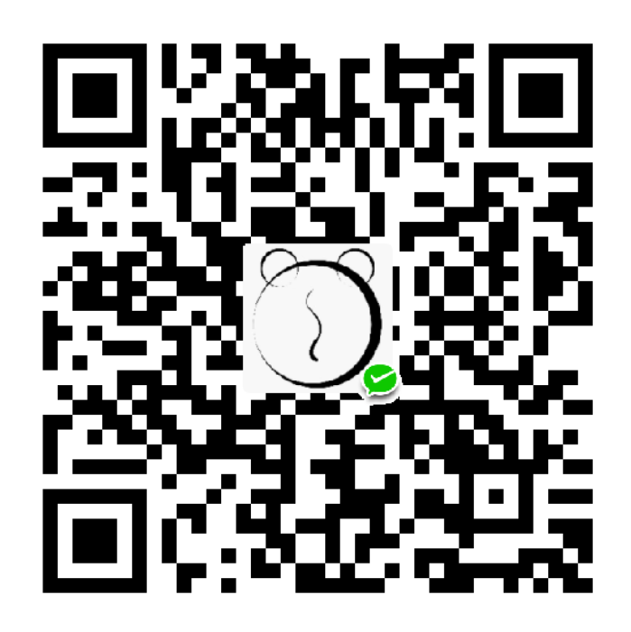

链接地址洗白白
===

当前版本：
---

### 规则版本：V2.2.1
### 书签版本：B0.3

这是什么：
---

这是一个小书签（Bookmarklet），把 js 文件的内容当做网址保存为书签，在需要的时候点击一下这个书签，就可以将当前网页的网址净化（去除不必要的 get 参数）。

默认情况会自动将净化后的网址保存当剪切板，并将当前页面转向至净化后的网址，以便验证可用性。当写入剪切板失败的时候会弹出提示框，可以自行复制网址，确认后网页自动跳转进行验证。

已有规则：
---

* 淘宝商品页
* 天猫商品页
* 淘宝店铺首页
* 天猫店铺首页
* 京东移动端商品页转 PC 端
* 谷歌搜索结果（只保留搜索关键词，不含过滤器）
* 必应搜索结果（只保留搜索关键词，不含过滤器）
* 百度搜索结果（只保留搜索关键词，不含过滤器）
* Apple itunes 应用商店（返回中文页面网址）
* Chrome 扩展商店
* Greasyfork 脚本页面
* Bilibili 视频页面
* 微博个人主页及单条微博页面（会强转为清爽的 HTML5 版）
* Steam 商店和创意工坊列表
* 小众软件论坛
* 其他较规范的网址

如果遇到常见网站未被支持，请告知作者，谢谢。

其他未列出网址也可尝试，万一可以用呢？

更新日期：
---
2018-09-26

更新日志：
---
### B0.3 2018.09.20

* 降低小书签轮询次数和函数嵌套层级，以期提升稳定性

### B0.2 2018.09.20

* 增加小书签版本号，方便日后提醒升级

### B0.1 2018.09.20

* 区分规则和小书签版本

### V2.2.0 2018.09.20

* 修复新版小书签无法复制问题

### V2.1.1 2018.09.19

* Fix bug

### V2.1.0 2018.09.19

* 从此版本开始，小书签支持自动更新

小书签安装（B0.3）：
---

**CDN 版：<a href="javascript:(function(){var dms_bookmarklet_version=0.3;let script=document.createElement('script');script.type='text/javascript';script.src='https://cdn.rawgit.com/dmscode/Link-cleaner/master/Link-cleaner-release.js';document.body.appendChild(script);window.setInterval(function(){if(typeof(dms_get_pure_url)==='function'){window.clearInterval();dms_get_pure_url()}},300)})()">链接地址洗白白（CDN）</a>** 用起来可能速度快些

**极速更新版：<a href="javascript:(function(){var dms_bookmarklet_version=0.3;let script=document.createElement('script');script.type='text/javascript';script.src='https://rawgit.com/dmscode/Link-cleaner/master/Link-cleaner-release.js';document.body.appendChild(script);window.setInterval(function(){if(typeof(dms_get_pure_url)==='function'){window.clearInterval();dms_get_pure_url()}},300)})()">链接地址洗白白（S）</a>** 第一时间获得规则更新

（将上方链接拖拽到书签栏即可，如上方不是链接，则先点击 **下面链接**，安装后第一次使用可能需要点击两次才能正常复制）

请我喝杯咖啡吧
---

如果觉得这个小书签对你有帮助，能不能微信扫描二维码，请我喝一杯咖啡？

毕竟，规则自动更新了，如没有极特殊情况，我也不会做更新提醒的。所以，差不多安装以后就再也不会回来看我了。

更新地址：
---

[https://dmscode.github.io/Link-cleaner/](https://dmscode.github.io/Link-cleaner/)